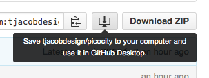

# How to Contribute

We expect a certain format on Picocity projects. Nothing too crazy, but just a few things to help make contributions as seamless as possible. Here are the rules:

* We indent using two spaces. It tends to just work better in more environments, and it looks better here in GitHub too. You should be able to configure your text editor to do this automatically, if you please.
* We start every file with a comment explaining at least two things: a short description of what it is, and the GitHub handle for whoever created it. See the [example.p8](example.p8) file for a good example of what this should look like.
* All lua code should be consistently formatted within the file. So if you’re contributing to someone else’s file, you should match their coding style to the best of your ability.

## Contributing to Someone Else’s Project

Here’s a step-by-step process for contributing to someone else’s project:

* If you don’t already have Git installed, install [GitHub Desktop](https://desktop.github.com/)
* Refresh this page, and click on an icon that looks like a computer monitor with an arrow pointing to it. Something that looks like this: 
* You should see Picocity in your GitHub app now. Then click the little button that looks like a "y", it should say "Create New Branch"
* Name the branch whatever you like ("pumpkin-game-bugfixes" or something similar)